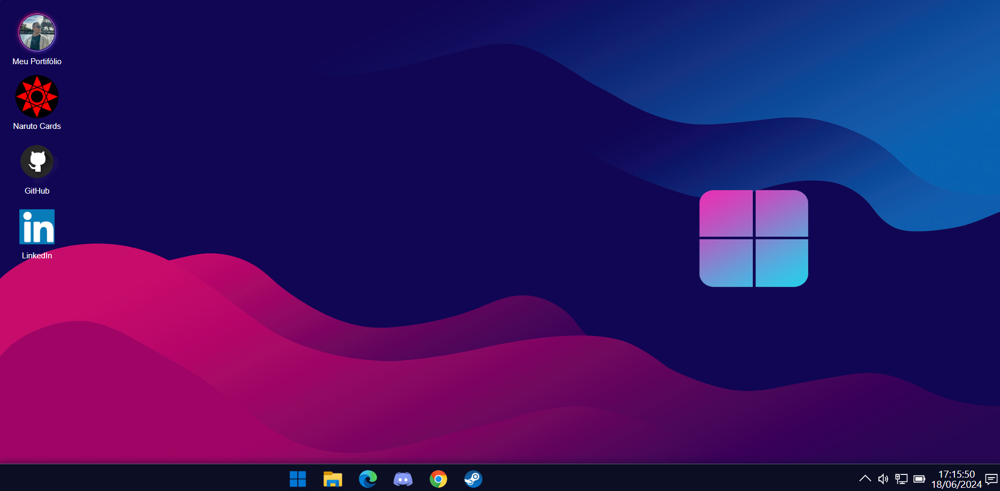
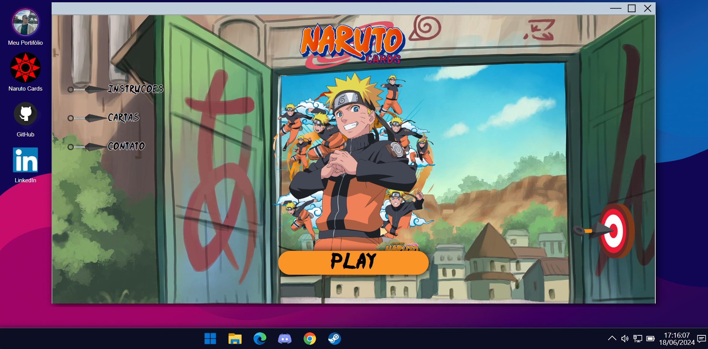

# EneasOS - Sistema Operacional

Projeto criado em React.js utilizando Html, CSS e JavaScript que simula a interação com um computador com o sistema operacional windowns, des do ato de apertar o botão para ligar o computador até clicar em um icone na area de trabalho

Disponivel no gitHub Pages https://lucaseneas.github.io/eneas-os/

## Fotos

